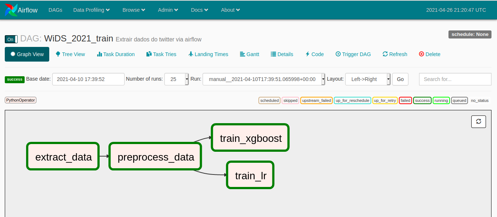
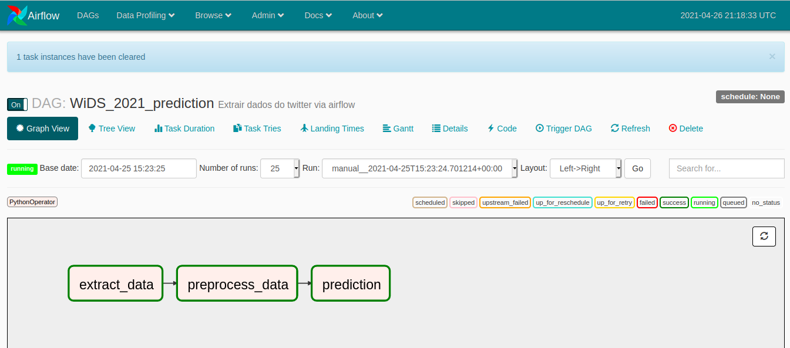

# Workshop-Airflow
Esse repositório contem os códigos utilizados no Workshop de Airflow

Estrutura do diretório
```bash
├── data
│   ├── raw
│   ├── transform
│   └── prediction
├── dag
│   ├── src
│       ├── extract_data
|         ├── extract_data.py
│       ├── preprocessing
│         ├── preprocessing.py
│       ├── train
|         ├── train.py
|       ├── predict
|         ├── predict.py
│   ├── DAG-WiDS_2021.py
│   └── DAG-WiDS_2021_predict.py
├── model
├── notebooks
├── images
├── README.md
└── .gitignore
```
### Arquivos
• **DAG-WiDS_2021.py** \
&emsp;Criação da DAG de treino com extração de dados do kaggle, preprocessamento e treino de um modelo de Regressão Logística e um modelo de Xgboost com GridSearch \
<br>
• **DAG-WiDS_2021_predict.py** \
&emsp;Criação da DAG de predição com extração de dados do kaggle, preprocessamento, escolha do melhor modelo utilizando AUC e predição \
<br>
• **extract-data.py** \
&emsp;Script para extração de dados do kaggle em .zip e salvar na pasta *data/raw* \
<br>
• **preprocessing.py** \
&emsp;Script de preprocessamento dos dados provindos de *data/raw* com a exclusão de colunas com muitos nans, com variáveis categóricas e colunas cujos dados têm baixa variância. A saída é salva na pasta *data/transform* \
<br>
• **train.py** \
&emsp;Treino de um modelo de Regressão Logística e um modelo de Xgboost com GridSearch. O pickel do modelo e os AUC são salvos na pasta *model* \
<br>
• **prediction.py** \
&emsp;Escolhe o melhor modelo utilizando AUC e realiza a predição. A saída é salva no arquivo *data/prediction/prediction.npy*  

### DAG de treino


### DAG de predição

